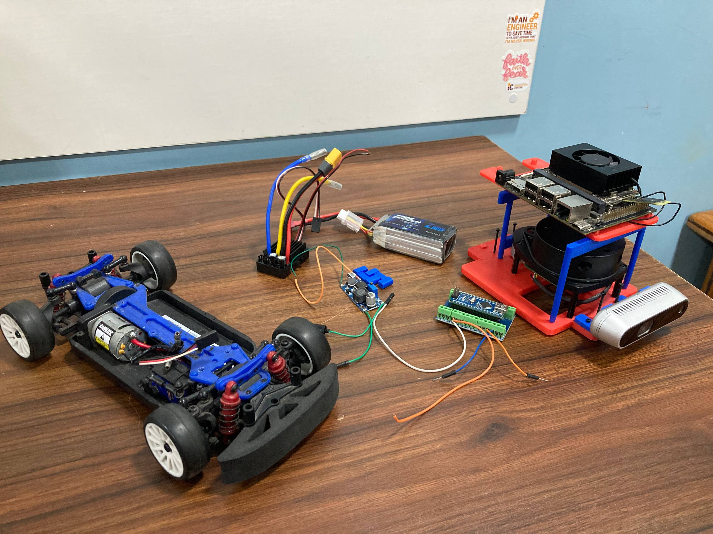
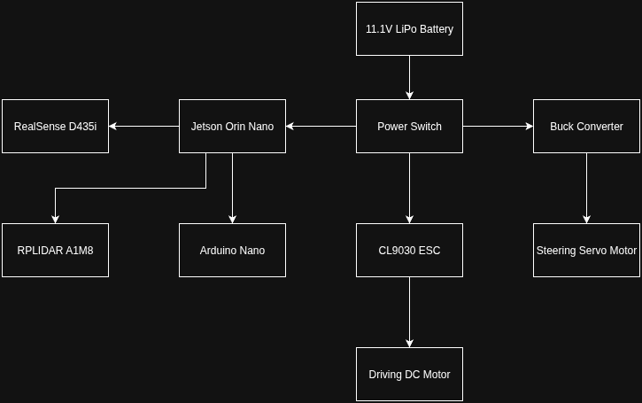
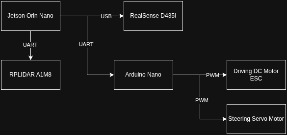
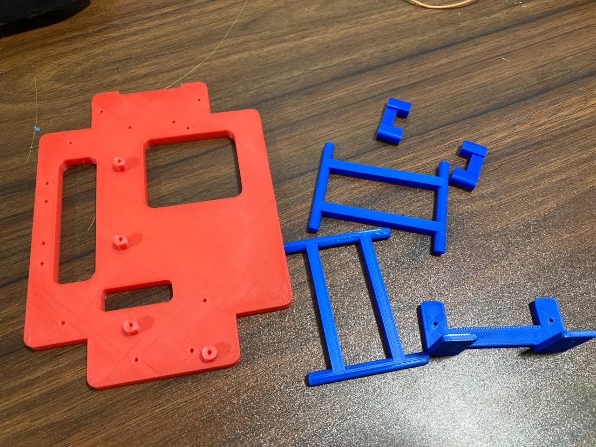

# Hardware Documentation and Setup Guide

Our autonomous vehicle is built on a LaTrax Rally RC car chassis, modified with custom electronics and sensors for the WRO Future Engineers competition. The system integrates an Intel RealSense D435i depth camera, RPLIDAR A1M8 360° laser scanner, NVIDIA Jetson Orin Nano for high-performance computing, and an Arduino Nano for low-level motor control. Power is managed through an 11.1V LiPo battery with voltage regulation for different components.

## List of Components

- **Base Chassis**: [LaTrax Rally RC Car](https://traxxas.com/75054-5-118-latrax-rally)
  - Stock dimensions: 380 x 185 mm (modified to meet competition size requirements)
  - Weight: Approximately 430g (before modifications)
  
- **Main Computer**: [NVIDIA Jetson Orin Nano](https://www.seeedstudio.com/NVIDIAr-Jetson-Orintm-Nano-Developer-Kit-p-5617.html)
  - 8GB RAM, 128-core NVIDIA GPU
  - Operating voltage: 19V/2.4A via barrel jack

- **Depth Camera**: [Intel RealSense D435i](https://store.intelrealsense.com/buy-intel-realsense-depth-camera-d435i.html)
  - RGB-D camera with IMU
  - Dimensions: 90 x 25 x 25 mm
  - Power: 5V/1A via USB

- **360° LiDAR**: [RPLIDAR A1M8](https://www.seeedstudio.com/RPLiDAR-A1M8-360-Degree-Laser-Scanner-Kit-12M-Range.html)
  - 12m range, 8000 samples/sec
  - 5.5Hz scan frequency
  - Dimensions: 97mm length x 70mm width x 55mm height
  - Power: 5V/100mA

- **Microcontroller**: [Arduino Nano](https://store.arduino.cc/products/arduino-nano?srsltid=AfmBOoq2YwgsdrZyhKjfQuPLMnf3RnoBkpLFdUXfpm5RYARqADG4-At2)
  - ATmega328P microcontroller
  - Operating voltage: 5V

- **Motor Controller**: [CL9030 ESC](https://www.amazon.com/Radiolink-Brushed-Waterproof-Built-Selectable/dp/B0D12PW7NV)
  - Compatible with 2-3S LiPo (7.4V-11.1V)
  - Continuous current: 90A

- **Steering Servo**: Stock LaTrax servo
  - Operating voltage: 4.8-6.0V

- **Power System**:
  - Main battery: 11.1V 2200mAh 3S LiPo
  - Voltage regulator: DC-DC Buck Converter (12V to 5V)

## Assembly

We started with the stock LaTrax Rally chassis and made the following modifications:

1. **Size Reduction**:
   - Trimmed body panels to achieve competition dimensions (300x200x300mm)

2. **Electronics Mounting**:
   - Designed and 3D-printed custom mounting plates for Jetson Orin, RealSense camera, and RPLIDAR
   - Implemented cable management system using braided sleeves and zip ties

3. **Sensor Integration**:
   - Mounted RealSense D435i at front for optimal track view
   - Installed RPLIDAR A1M8 on bottom deck for left and right side wall detection
   - Positioned sensors to minimize interference between vision and LiDAR systems

4. **Weight Distribution**:
   - Positioned heaviest components (battery, RPLidar) low in the chassis
   - Balanced left/right weight distribution considering RPLIDAR's weight
   - Verified center of gravity after all modifications

*(Diagram showing component layout with RPLIDAR positioned on bottom deck)*

## Wiring Diagrams

### Power Distribution System

*(Diagram showing how power is distrbuted to each component)*

### Signal Wiring Diagram

*(Diagram showing how signal is wired to each component)*

### Detailed Pin Connections

**Jetson Orin Nano GPIO Connections**:
- USB3.0: Connected to RealSense D435i
- USB3.0: Connected to RPLIDAR A1M8
- USB3.0: Connected to Arduino Nano

**Arduino Nano Pinout**:
- D9: PWM output to ESC (DC Motor control)
- D10: PWM output to Steering Servo

## Power System Details

The power hierarchy is designed for efficiency and safety:

1. **Primary Power Path**:
   - 11.1V LiPo → main switch → ESC → DC Motor
   - Unregulated for motor power (requires full voltage)
   - 11.1V LiPo → main switch → Jetson Orin Nano

2. **Secondary Power Path**:
   - 11.1V LiPo → Buck Converter → 5V bus
   - Powers:
     - Steering servo

## Sensor Integration

**RealSense D435i**:
- Mounted at 90° angle for optimal track view
- Provides RGB, depth, and IMU data
- Used for:
   - Lane detection (color segmentation)
   - Close-range obstacle detection
   - Traffic sign recognition (RGB camera)

**RPLIDAR A1M8**:
- Mounted vertically on bottom deck
- Provides 360° 2D point cloud
- Used for:
   - Track boundary mapping
   - Long-range obstacle detection
   - Parking space identification
   - Fusion with D435i data for improved reliability

**Sensor Fusion**:
- Combined D435i depth data with RPLIDAR point cloud
- IMU data used to compensate for vehicle motion
- Confidence-weighted decision making between sensors

## Drive System Configuration

The vehicle maintains the stock LaTrax drivetrain with modifications:

1. **Steering System**:
   - PID control implemented in Python using fused sensor data
   - Combines RPLIDAR wall detection with camera lane keeping

2. **Drive Motor**:
   - Stock 370 brushed motor
   - ESC configured for linear throttle response
   - Speed adjusted based on RPLIDAR obstacle proximity

3. **Control Hierarchy**:
   - Jetson handles high-level path planning using both sensors
   - Arduino implements low-level motor control
   - Communication via serial at 115200 baud

## 3D Printed Components

We designed and printed several custom parts:

1. **LiDAR Mount**:
   - Low-profile rotating platform for RPLIDAR
   - Quick-release mechanism for maintenance

2. **Camera Mount**:
   - Positioned to avoid LiDAR interference

3. **Custom Base Plate**:
   - 3D-printed plate for mounting all major boards
   - Integrated cable management channels
   - Designed with cutouts for LiDAR wiring

4. **Jetson Support Structure**:
   - Rigid support bracket
   - Positioned to balance LiDAR weight

*(Image of custom 3D printed components)*

## Competition-Specific Modifications

To meet WRO requirements:

1. **Autonomous Operation**:
   - Sensor fusion between RPLIDAR and D435i for redundancy
   - Fail-safes if either sensor fails

2. **Size Verification**:
   - RPLIDAR mount designed to collapse for size checks
   - Total height with LiDAR: 170mm (under 300mm limit)

3. **Documentation Features**:
   - Added status LEDs for robot status monitoring
   - Labeled Serial connections clearly

## Build Instructions

1. **Chassis Preparation**:
   - Remove stock electronics
   - Reinforce chassis to handle additional sensor weight

2. **LiDAR Installation**:
   1. Secure RPLIDAR to base mount using M3 screws
   2. Attach Jetson support mount to base mount using M2 screws
   3. Route USB cable through cable channels to Jetson
   4. Connect power to 5V bus

3. **Sensor Alignment**:
   - Verify RPLIDAR rotates freely
   - Ensure no obstruction in left and right field of view
   - Check clearance between LiDAR and camera

4. **Final Checks**:
   - Test sensor fusion algorithms
   - Verify weight distribution
   - Measure final dimensions with LiDAR deployed

## Conclusion

This documentation provides complete information about our vehicle's hardware implementation. The system is designed for reliability, maintainability, and performance in the WRO Future Engineers competition. This multi-sensor approach improves reliability in all competition scenarios, particularly for obstacle avoidance and precise parking maneuvers. All components were carefully integrated to maintain compliance with WRO size and weight requirements while maximizing autonomous performance.